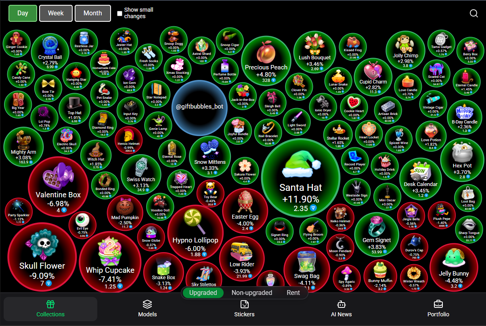
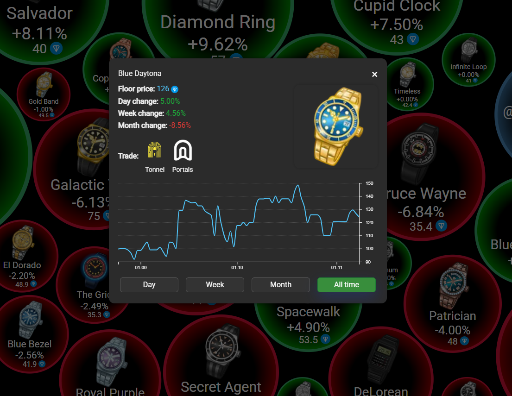

<h2 align="center">Hi , I'm Heorhi   Python, Java & Full Stack Developer </h2>

  <a href="https://github.com/smunlae?tab=repositories">Projects</a> •
  <a href="https://t.me/y48495">Telegram</a> •
  <a href="mailto:smunlae@gmail.com">Email</a>

  <strong>Building data-driven apps and Telegram Mini Apps.</strong> 
  <em>Shipped Gift Bubbles (10k MAU, 300–500 DAU) — assets profit/loss calculation from ~1h → ~1min.</em>

---

## Skills

<!-- Backend -->

  

<!-- Frontend -->

  

<!-- Data & DevOps -->

  

---

## GitHub Stats

  
  

 

  
More metrics

  

    
  

  

    
  

  

    
  

---

## Featured: Gift Bubbles
A Telegram Mini App & web dashboard for Telegram collectible gifts.

- 🔎 Price tracking & visualizations (D3/React/Next.js)
- 🧮 Auto P/L for users’ holdings (PostgreSQL + Python/FastAPI)
- ⚙️ Caching & background jobs; Dockerized; CI via GitHub Actions
- 📈 Usage: ~5k MAU (peak ~10k), 300–500 DAU

<table>
  <tr>
    <td>
      
    </td>
    <td>
      
    </td>
  </tr>
</table>

<!-- Одна снизу -->

  

---

## Links
- Mini App: <a href="https://t.me/giftbubbles_bot">t.me/giftbubbles_bot</a>
- Telegram group: <a href="https://t.me/giftsbubbles">t.me/giftsbubbles</a>
- Tech stack highlights: Python (FastAPI/Flask), React/Next.js/D3, PostgreSQL/Redis, Docker, GH Actions, Vercel/Railway
